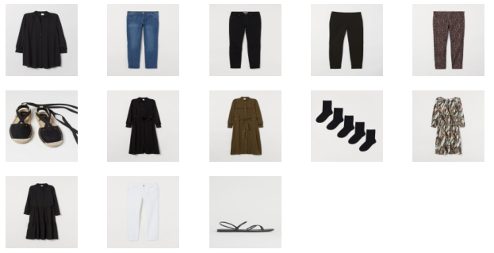

# FashionNet
CIS 5220 Deep Learning Project

### Abstract
In this project, we focus on H&M data set to recommend proper outfits for customers. The dataset contains customer information, item information and transaction information.

We used different models (**Content Based KNN, MLP, and GNN**) and compared the results.

### Evaluation

We use customer hit rate as the evaluation metric. 
For each customer with N purchases, we take out the i-th article bought by the customer and make 50 recommendations based on the rest N-1 articles, then check whether i-th purchase is in the 50 articles. We repeat the process and leave out each article from the list of all articles bought by the customer, if any of the left-out item is in the set of 50 recommended articles, the customer is considered "hit", otherwise 'miss". The customer hit rate is calculated by hit/(hit+miss).

| model   | KNN  | MLP  | GNN  |
|---------|------|------|------|
| HitRate | 0.53 | 0.58 | 0.95 |

### Results

 

<figcaption>Articles Actually Bought</figcaption>

 

<figcaption>Articles Recommended by KNN</figcaption>

 

<figcaption>Articles Recommended by Fully Connected Deep Learning Model</figcaption>

 

<figcaption>Articles Recommended by Graph Neural Network Model</figcaption>

